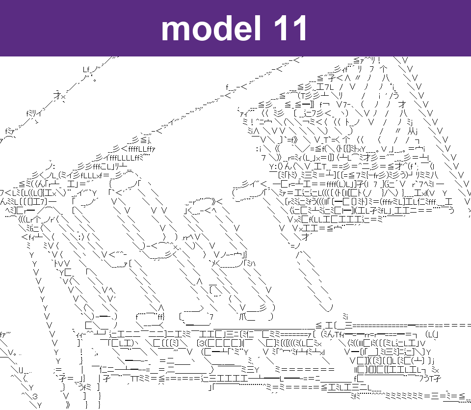
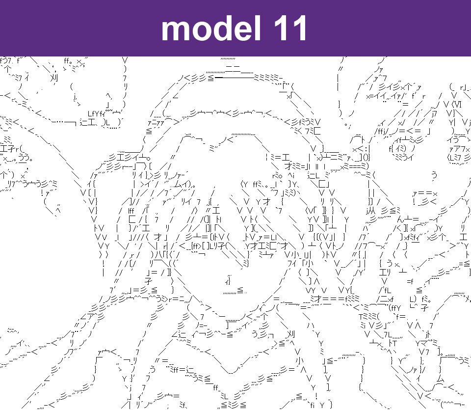
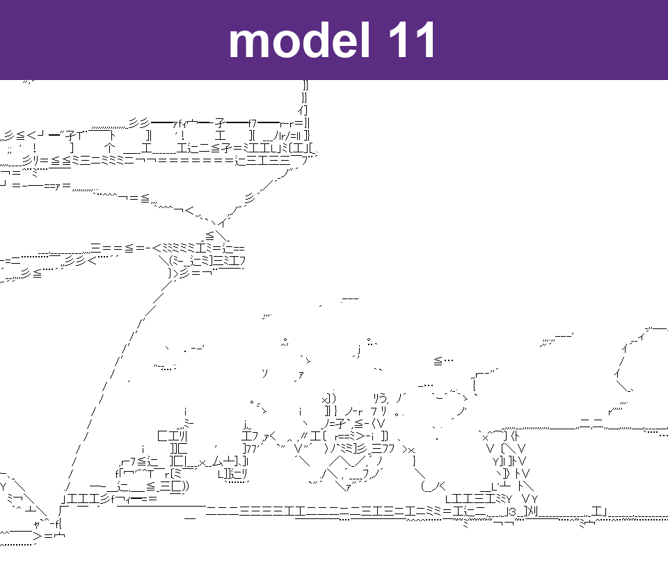
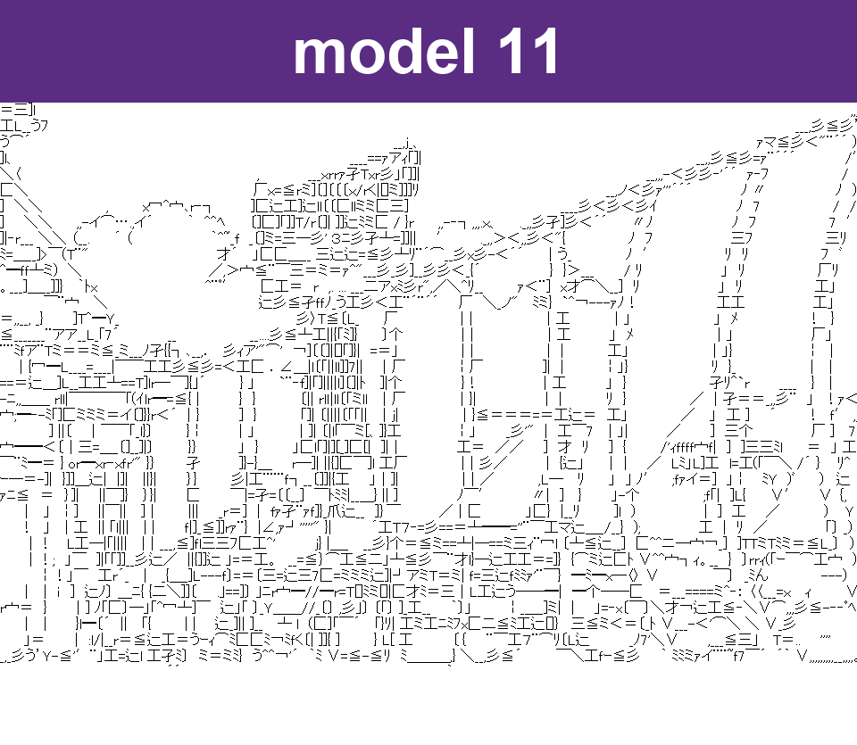
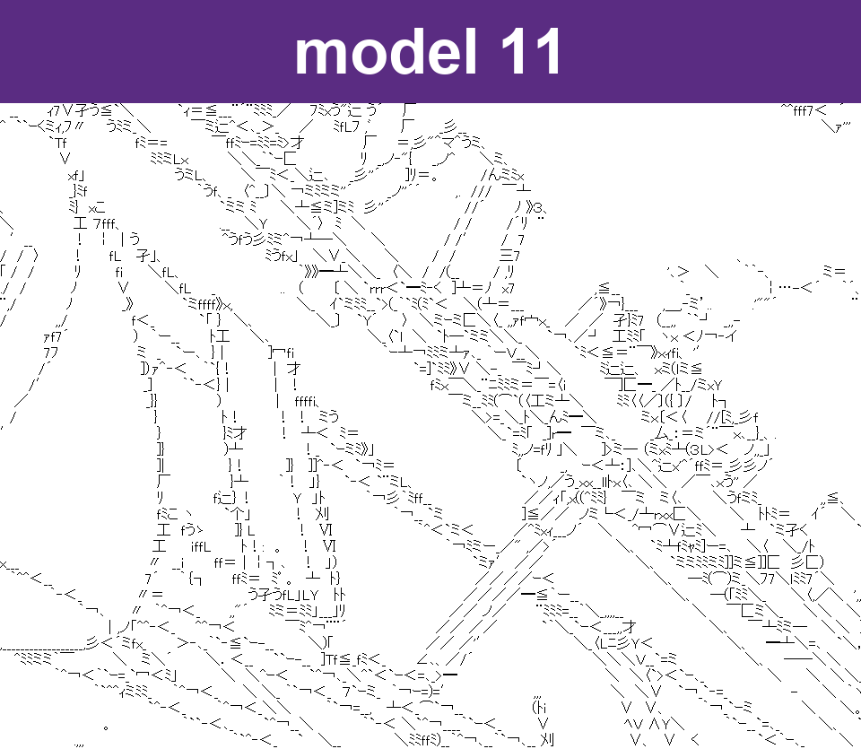
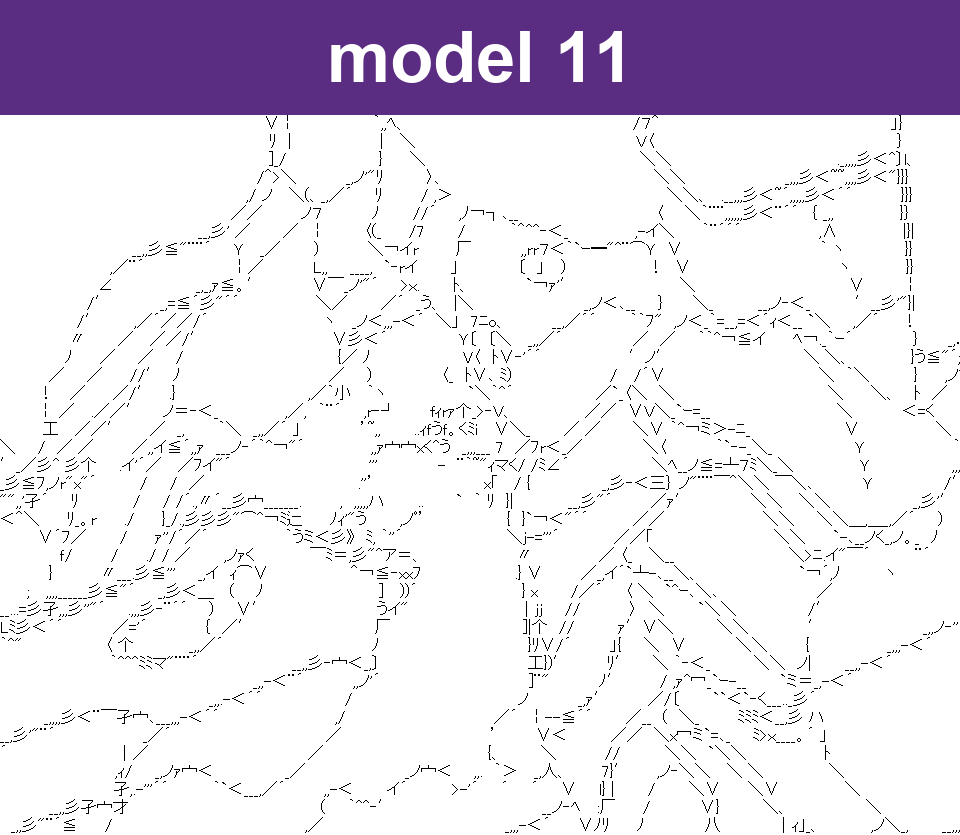
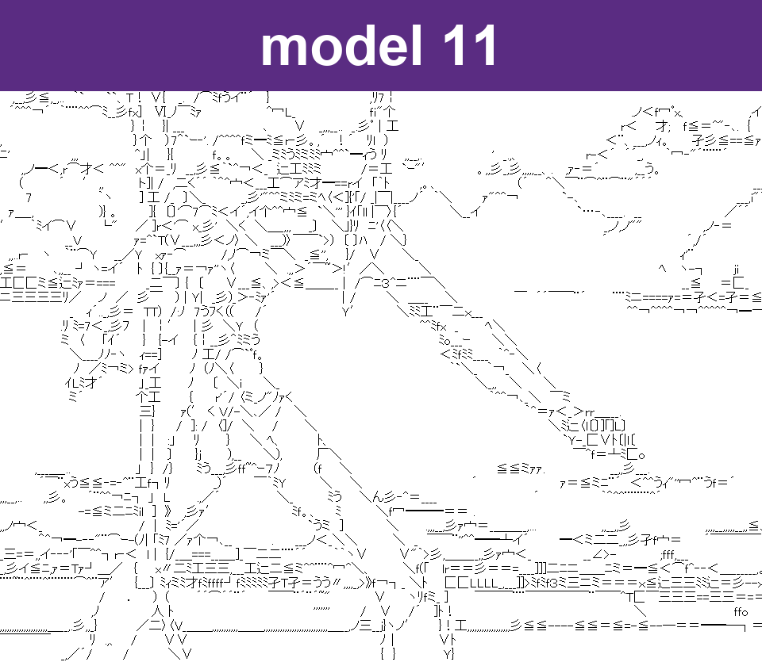
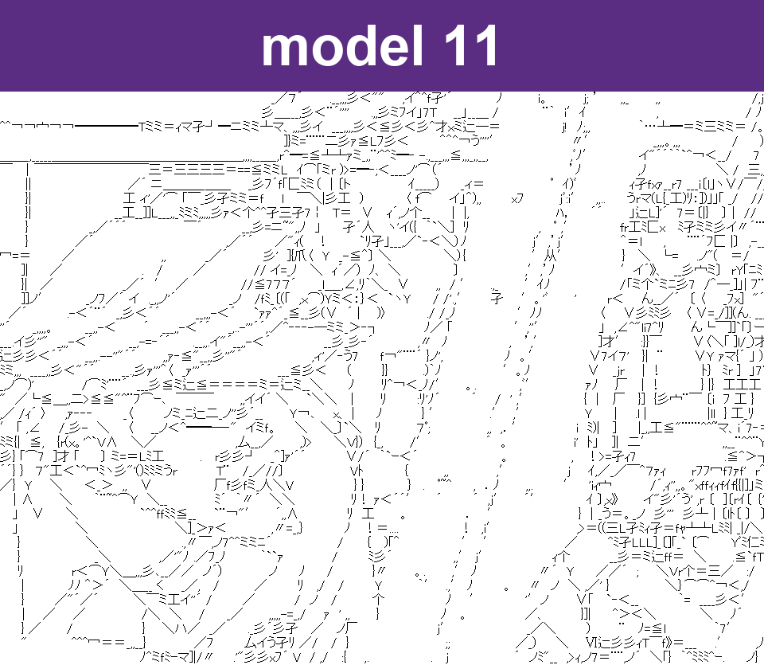

# ascii_art_project

## 引用 / Reference

. *DeepAA*. 2017. <https://github.com/taizan/DeepAA>

## 模型对比 / Models

| | line_art_demo（模型 5） | 模型 10 | 模型 11 | 官方 DeepAA |
|---|---|---|---|---|
| Origin | **Self-made**, 0 NN weights | Frozen official conv + FC512, skip empty windows | Same as 10, batch windows across rows | Full official net |
| Characters | Direction strokes `/ \ - \| ~` only | Official 411, variable width | Same as 10 | Official 411 |
| Layout | Fixed 18×30 grid; **glyphs look smaller** in the comparison | `char_dict` variable width, 18px rows | Same as 10 | Same as 10 (slide=0 here) |
| Params | 0 | ~10.6M | ~10.6M | ~87.3M |
| Script | `src/line_art_demo.py` | `src/line_art_10.py` | `src/line_art_11.py` | `src/line_art_8_puredeepaa.py` |

Model 10/11 keep official DeepAA decode on a smaller head. Model 10 skips nearly empty 64×64 windows (`--ink-skip 0.0008`). Model 11 is 10 plus one batched forward per step across independent rows. `line_art_10.py` / `line_art_11.py` are standalone; take the `.py` plus `models/deepaa_official/weight_smallhead.pt` and `char_dict.pkl`. Model 9 is the same weights without empty-skip (`src/line_art_9.py`). On the 8 EVA stills, 10 matched 9 exactly and skipped 13.9% of windows; 11 matches 10.

## EVA 8 帧对照 / EVA 8-frame comparison

AniLines detail from *明日香来日*. Each row: **line** · **DeepAA** · **line_art_demo** · **10** · **11**.

line_art_demo uses a fixed grid, so **its characters are smaller** than DeepAA / 10 / 11. 10 and 11 use `--width 0`. Official DeepAA here is `line-art-8-puredeepaa` (full FC4096 weights). 11 matches 10 visually (same decode, batched).

### 01 · f72

| line | DeepAA | line_art_demo | model 10 | model 11 |
|:---:|:---:|:---:|:---:|:---:|
|  |  |  |  |  |

### 02 · f163

| line | DeepAA | line_art_demo | model 10 | model 11 |
|:---:|:---:|:---:|:---:|:---:|
|  |  |  |  |  |

### 03 · f253

| line | DeepAA | line_art_demo | model 10 | model 11 |
|:---:|:---:|:---:|:---:|:---:|
|  |  |  |  |  |

### 04 · f344

| line | DeepAA | line_art_demo | model 10 | model 11 |
|:---:|:---:|:---:|:---:|:---:|
|  |  |  |  |  |

### 05 · f434

| line | DeepAA | line_art_demo | model 10 | model 11 |
|:---:|:---:|:---:|:---:|:---:|
|  |  |  |  |  |

### 06 · f525

| line | DeepAA | line_art_demo | model 10 | model 11 |
|:---:|:---:|:---:|:---:|:---:|
|  |  |  |  |  |

### 07 · f616

| line | DeepAA | line_art_demo | model 10 | model 11 |
|:---:|:---:|:---:|:---:|:---:|
|  |  |  |  |  |

### 08 · f706

| line | DeepAA | line_art_demo | model 10 | model 11 |
|:---:|:---:|:---:|:---:|:---:|
|  |  |  |  |  |

## 目录 / Layout

```text
src/                     converters
models/deepaa_official/  official DeepAA charset, glyphs, small-head
models/anilines/         AniLines (downloaded on first run)
models/own/              self-trained CNNs (not official DeepAA)
samples/eva-compare/     EVA stills: line / DeepAA / line_art_demo / 10 / 11
output/videos/line|ascii|source   local videos (gitignored)
```

## 运行 / Run

```text
pip install -r requirements.txt
```

Model 5 (direction ASCII):

```text
python src/line_art_demo.py --from-lines --input input/eva-line --output output/line_art_demo --width 160
```

Model 9 (lightweight DeepAA):

```text
python src/line_art_9.py --from-lines --width 0 --input input/eva-line --output output/line-art-9-deepaa-light
```

Model 10 (same as 9, skip empty windows):

```text
python src/line_art_10.py --from-lines --width 0 --input input/eva-line --output output/line-art-10-deepaa-light-empty-skip
```

Raise `--ink-skip` only after checking that strokes are not dropped (try `0.002`, then `0.005`). `0` equals model 9.

Model 11 (model 10 empty-skip + batch one window from every row per step):

```text
python src/line_art_11.py --from-lines --width 0 --input input/eva-line --output output/line-art-11-deepaa-light-row-batch
```

AniLines line video:

```text
python src/anilines.py --input path/to/clip.mp4 --output output/videos/line --fps 0 --max-side 960
```

Official full DeepAA (`weight_full.pt`, local only; convert from `data/weight.hdf5`):

```text
python src/line_art_8_puredeepaa.py --from-lines --width 0 --input input/eva-line
```
